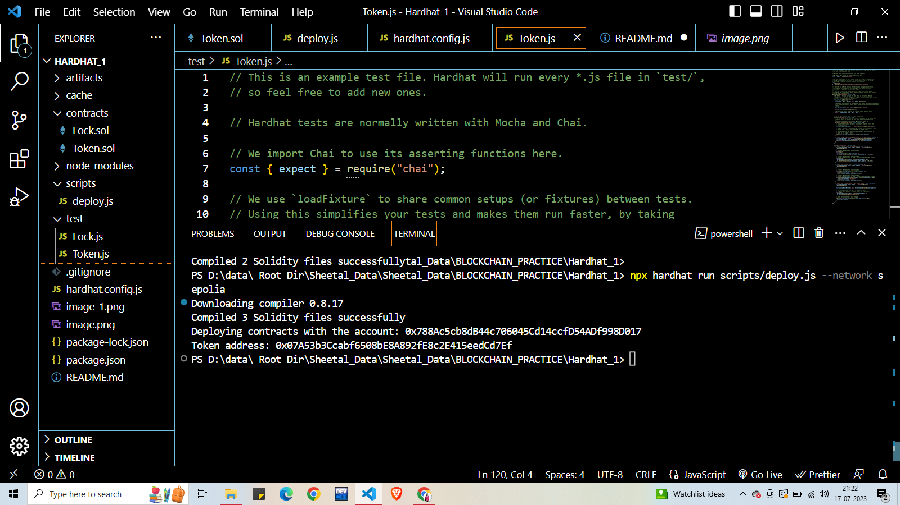
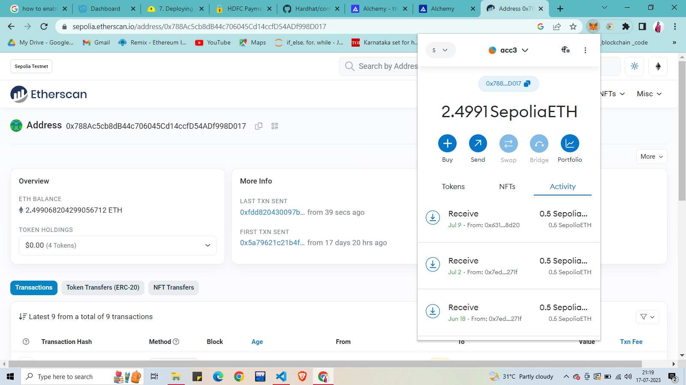
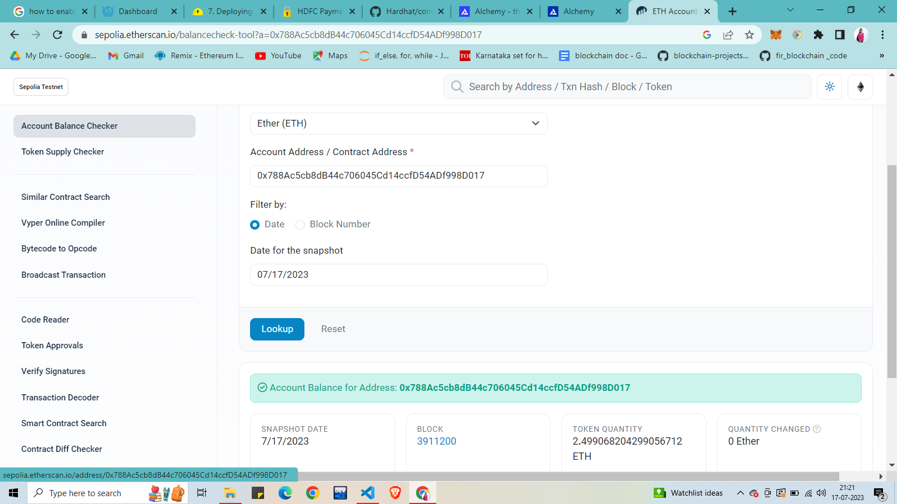
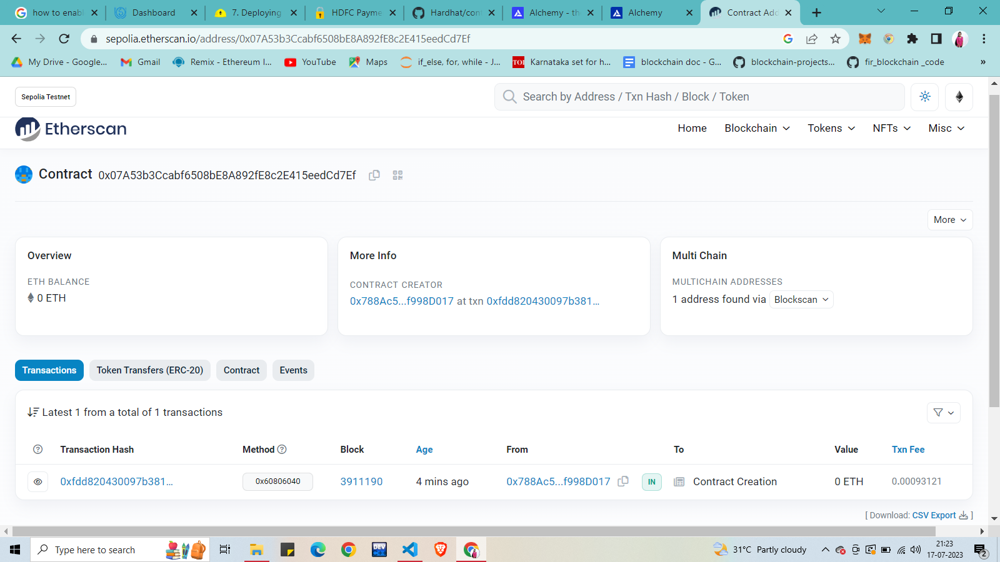

# TOKEN CREATION USING HARDHAT
- Setting up your Node.js environment for Ethereum development
- Creating and configuring a Hardhat project
- The basics of a Solidity smart contract that implements a token
- Writing automated tests for your contract using Hardhat
- Debugging Solidity with console.log() using Hardhat Network
- Deploying your contract to Hardhat Network and Ethereum testnets

# Setting up the Environment:
- Install NODE.JS

# Creating a new Hardhat project
We'll install Hardhat using the Node.js package manager (npm), which is both a package manager and an online repository for JavaScript code.

You can use other package managers with Node.js, but we suggest you use npm 7 or higher to follow this guide. You should already have it if you followed the previous section's steps.

Open a new terminal and run these commands to create a new folder:

mkdir hardhat-tutorial
cd hardhat-tutorial
Then initialize an npm project as shown below. You'll be prompted to answer some questions.

npm init
Now we can install Hardhat:

npm install --save-dev hardhat
In the same directory where you installed Hardhat run:

npx hardhat
Select Create an empty hardhat.config.js with your keyboard and hit enter.

👷 Welcome to Hardhat v2.17.0 👷‍

? What do you want to do? …
  Create a JavaScript project
  Create a TypeScript project
❯ Create an empty hardhat.config.js
  Quit
When Hardhat is run, it searches for the closest hardhat.config.js file starting from the current working directory. This file normally lives in the root of your project and an empty hardhat.config.js is enough for Hardhat to work. The entirety of your setup is contained in this file.

# Hardhat's architecture
Hardhat is designed around the concepts of tasks and plugins. The bulk of Hardhat's functionality comes from plugins, and you're free to choose the ones you want to use.

# Tasks
Every time you're running Hardhat from the command-line, you're running a task. For example, npx hardhat compile is running the compile task. To see the currently available tasks in your project, run npx hardhat. Feel free to explore any task by running npx hardhat help .

# Plugins
Hardhat is unopinionated in terms of what tools you end up using, but it does come with some built-in defaults. All of which can be overridden. Most of the time the way to use a given tool is by consuming a plugin that integrates it into Hardhat.

In this tutorial we are going to use our recommended plugin, 
@nomicfoundation/hardhat-toolbox
, which has everything you need for developing smart contracts.

To install it, run this in your project directory:

npm install --save-dev @nomicfoundation/hardhat-toolbox
Add the highlighted line to your hardhat.config.js so that it looks like this:

require("@nomicfoundation/hardhat-toolbox");

/** @type import('hardhat/config').HardhatUserConfig */
module.exports = {
  solidity: "0.8.19",
};

# Writing and compiling smart contracts
We're going to create a simple smart contract that implements a token that can be transferred. Token contracts are most frequently used to exchange or store value. We won't go in depth into the Solidity code of the contract on this tutorial, but there's some logic we implemented that you should know:

There is a fixed total supply of tokens that can't be changed.
The entire supply is assigned to the address that deploys the contract.
Anyone can receive tokens.
Anyone with at least one token can transfer tokens.
The token is non-divisible. You can transfer 1, 2, 3 or 37 tokens but not 2.5.

# Writing smart contracts
Start by creating a new directory called contracts and create a file inside the directory called Token.sol.

Paste the code below into the file and take a minute to read the code. It's simple and it's full of comments explaining the basics of Solidity.

//SPDX-License-Identifier: UNLICENSED

// Solidity files have to start with this pragma.
// It will be used by the Solidity compiler to validate its version.
pragma solidity ^0.8.0;

// This is the main building block for smart contracts.
contract Token {
    // Some string type variables to identify the token.
    string public name = "My Hardhat Token";
    string public symbol = "MHT";

    // The fixed amount of tokens, stored in an unsigned integer type variable.
    uint256 public totalSupply = 1000000;

    // An address type variable is used to store ethereum accounts.
    address public owner;

    // A mapping is a key/value map. Here we store each account's balance.
    mapping(address => uint256) balances;

    // The Transfer event helps off-chain applications understand
    // what happens within your contract.
    event Transfer(address indexed _from, address indexed _to, uint256 _value);

    /**
     * Contract initialization.
     */
    constructor() {
        // The totalSupply is assigned to the transaction sender, which is the
        // account that is deploying the contract.
        balances[msg.sender] = totalSupply;
        owner = msg.sender;
    }

    /**
     * A function to transfer tokens.
     *
     * The `external` modifier makes a function *only* callable from *outside*
     * the contract.
     */
    function transfer(address to, uint256 amount) external {
        // Check if the transaction sender has enough tokens.
        // If `require`'s first argument evaluates to `false` then the
        // transaction will revert.
        require(balances[msg.sender] >= amount, "Not enough tokens");

        // Transfer the amount.
        balances[msg.sender] -= amount;
        balances[to] += amount;

        // Notify off-chain applications of the transfer.
        emit Transfer(msg.sender, to, amount);
    }

    /**
     * Read only function to retrieve the token balance of a given account.
     *
     * The `view` modifier indicates that it doesn't modify the contract's
     * state, which allows us to call it without executing a transaction.
     */
    function balanceOf(address account) external view returns (uint256) {
        return balances[account];
    }
}

# Compiling contracts
To compile the contract run npx hardhat compile in your terminal. The compile task is one of the built-in tasks.

$ npx hardhat compile
Compiling 1 file with 0.8.19
Compilation finished successfully
The contract has been successfully compiled and it's ready to be used.

# Testing contracts

// This is an example test file. Hardhat will run every *.js file in `test/`,
// so feel free to add new ones.

// Hardhat tests are normally written with Mocha and Chai.

// We import Chai to use its asserting functions here.
const { expect } = require("chai");

// We use `loadFixture` to share common setups (or fixtures) between tests.
// Using this simplifies your tests and makes them run faster, by taking
// advantage of Hardhat Network's snapshot functionality.
const {
  loadFixture,
} = require("@nomicfoundation/hardhat-toolbox/network-helpers");

// `describe` is a Mocha function that allows you to organize your tests.
// Having your tests organized makes debugging them easier. All Mocha
// functions are available in the global scope.
//
// `describe` receives the name of a section of your test suite, and a
// callback. The callback must define the tests of that section. This callback
// can't be an async function.
describe("Token contract", function () {
  // We define a fixture to reuse the same setup in every test. We use
  // loadFixture to run this setup once, snapshot that state, and reset Hardhat
  // Network to that snapshot in every test.
  async function deployTokenFixture() {
    // Get the Signers here.
    const [owner, addr1, addr2] = await ethers.getSigners();

    // To deploy our contract, we just have to call ethers.deployContract and await
    // its waitForDeployment() method, which happens once its transaction has been
    // mined.
    const hardhatToken = await ethers.deployContract("Token");

    await hardhatToken.waitForDeployment();

    // Fixtures can return anything you consider useful for your tests
    return { hardhatToken, owner, addr1, addr2 };
  }

  // You can nest describe calls to create subsections.
  describe("Deployment", function () {
    // `it` is another Mocha function. This is the one you use to define each
    // of your tests. It receives the test name, and a callback function.
    //
    // If the callback function is async, Mocha will `await` it.
    it("Should set the right owner", async function () {
      // We use loadFixture to setup our environment, and then assert that
      // things went well
      const { hardhatToken, owner } = await loadFixture(deployTokenFixture);

      // `expect` receives a value and wraps it in an assertion object. These
      // objects have a lot of utility methods to assert values.

      // This test expects the owner variable stored in the contract to be
      // equal to our Signer's owner.
      expect(await hardhatToken.owner()).to.equal(owner.address);
    });

    it("Should assign the total supply of tokens to the owner", async function () {
      const { hardhatToken, owner } = await loadFixture(deployTokenFixture);
      const ownerBalance = await hardhatToken.balanceOf(owner.address);
      expect(await hardhatToken.totalSupply()).to.equal(ownerBalance);
    });
  });

  describe("Transactions", function () {
    it("Should transfer tokens between accounts", async function () {
      const { hardhatToken, owner, addr1, addr2 } = await loadFixture(
        deployTokenFixture
      );
      // Transfer 50 tokens from owner to addr1
      await expect(
        hardhatToken.transfer(addr1.address, 50)
      ).to.changeTokenBalances(hardhatToken, [owner, addr1], [-50, 50]);

      // Transfer 50 tokens from addr1 to addr2
      // We use .connect(signer) to send a transaction from another account
      await expect(
        hardhatToken.connect(addr1).transfer(addr2.address, 50)
      ).to.changeTokenBalances(hardhatToken, [addr1, addr2], [-50, 50]);
    });

    it("Should emit Transfer events", async function () {
      const { hardhatToken, owner, addr1, addr2 } = await loadFixture(
        deployTokenFixture
      );

      // Transfer 50 tokens from owner to addr1
      await expect(hardhatToken.transfer(addr1.address, 50))
        .to.emit(hardhatToken, "Transfer")
        .withArgs(owner.address, addr1.address, 50);

      // Transfer 50 tokens from addr1 to addr2
      // We use .connect(signer) to send a transaction from another account
      await expect(hardhatToken.connect(addr1).transfer(addr2.address, 50))
        .to.emit(hardhatToken, "Transfer")
        .withArgs(addr1.address, addr2.address, 50);
    });

    it("Should fail if sender doesn't have enough tokens", async function () {
      const { hardhatToken, owner, addr1 } = await loadFixture(
        deployTokenFixture
      );
      const initialOwnerBalance = await hardhatToken.balanceOf(owner.address);

      // Try to send 1 token from addr1 (0 tokens) to owner.
      // `require` will evaluate false and revert the transaction.
      await expect(
        hardhatToken.connect(addr1).transfer(owner.address, 1)
      ).to.be.revertedWith("Not enough tokens");

      // Owner balance shouldn't have changed.
      expect(await hardhatToken.balanceOf(owner.address)).to.equal(
        initialOwnerBalance
      );
    });
  });
});
This is what the output of npx hardhat test should look like against the full test suite:

$ npx hardhat test

  Token contract
    Deployment
      ✓ Should set the right owner
      ✓ Should assign the total supply of tokens to the owner
    Transactions
      ✓ Should transfer tokens between accounts (199ms)
      ✓ Should fail if sender doesn’t have enough tokens
      ✓ Should update balances after transfers (111ms)

  5 passing (1s)

# Deploying to a live network
Once you're ready to share your dApp with other people, you may want to deploy it to a live network. This way others can access an instance that's not running locally on your system.

The "mainnet" Ethereum network deals with real money, but there are separate "testnet" networks that do not. These testnets provide shared staging environments that do a good job of mimicking the real world scenario without putting real money at stake, and Ethereum has several, like Sepolia and Goerli. We recommend you deploy your contracts to the Sepolia testnet.

At the software level, deploying to a testnet is the same as deploying to mainnet. The only difference is which network you connect to. Let's look into what the code to deploy your contracts using ethers.js would look like.

The main concepts used are Signer and Contract which we explained back in the testing section. There's nothing new that needs to be done when compared to testing, given that when you're testing your contracts you're actually making a deployment to your development network. This makes the code very similar, or even the same.

Let's create a new directory scripts inside the project root's directory, and paste the following into a deploy.js file in that directory:

async function main() {
  const [deployer] = await ethers.getSigners();

  console.log("Deploying contracts with the account:", deployer.address);

  const token = await ethers.deployContract("Token");

  console.log("Token address:", await token.getAddress());
}

main()
  .then(() => process.exit(0))
  .catch((error) => {
    console.error(error);
    process.exit(1);
  });
To tell Hardhat to connect to a specific Ethereum network, you can use the --network parameter when running any task, like this:

npx hardhat run scripts/deploy.js --network <network-name>
With our current configuration, running it without the --network parameter would cause the code to run against an embedded instance of Hardhat Network. In this scenario, the deployment actually gets lost when Hardhat finishes running, but it's still useful to test that our deployment code works:

$ npx hardhat run scripts/deploy.js
Deploying contracts with the account: 0xf39Fd6e51aad88F6F4ce6aB8827279cffFb92266
Token address: 0x5FbDB2315678afecb367f032d93F642f64180aa3

# Deploying to remote networks
To deploy to a remote network such as mainnet or any testnet, you need to add a network entry to your hardhat.config.js file. We’ll use Sepolia for this example, but you can add any network similarly:

Infura
Alchemy
require("@nomicfoundation/hardhat-toolbox");

// Go to https://alchemy.com, sign up, create a new App in
// its dashboard, and replace "KEY" with its key
const ALCHEMY_API_KEY = "KEY";

// Replace this private key with your Sepolia account private key
// To export your private key from Coinbase Wallet, go to
// Settings > Developer Settings > Show private key
// To export your private key from Metamask, open Metamask and
// go to Account Details > Export Private Key
// Beware: NEVER put real Ether into testing accounts
const SEPOLIA_PRIVATE_KEY = "YOUR SEPOLIA PRIVATE KEY";

module.exports = {
  solidity: "0.8.17",
  networks: {
    sepolia: {
      url: `https://eth-sepolia.g.alchemy.com/v2/${ALCHEMY_API_KEY}`,
      accounts: [SEPOLIA_PRIVATE_KEY]
    }
  }
};

#DEPLOYMENT:

Deploying contracts with the account: 0x788Ac5cb8dB44c706045Cd14ccfD54ADf998D017
Token address: 0x07A53b3Ccabf6508bE8A892fE8c2E415eedCd7Ef

#AFTER DEPLOYMENT
#Deploying contract with the account checking on sepolia etherscan: 

#Token_address: check on Sepolia etherscan

